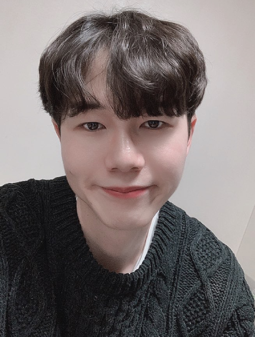

## 1. INTEREST and SKILLS

- interested in Machine Learning and Computer Vision, concretely object detection, OCR, GAN.
- have worked in the domain of comics and webtoon.
* Programming Language : Python, Java, C, C++ 
* Framework : pytorch, tensorflow, opencv
* etc: linux(centOS, Ubuntu)

## 2. WORK EXPERIENCE

- ### [Idea Concert](http://www.ideaconcert.com/) (2019.07.01 - )
  - #### AI Research Engineer Intern 
    - Webtoon speech bubble detection based on faster rcnn and image processing
    - Webtoon cut detection based on image processing
    - Text detection based on [CRAFT](https://arxiv.org/abs/1904.01941) and implemented train code
    - Hangul text recognition of character unit with CRAFT text detector 

 - ### [NAVER WEBTOON Corp](https://webtoonscorp.com/) (2020.01.06 - )
    - #### AI Research Engineer Intern 

## 3. EDUCATION

  - UNIVERSITY OF AJOU, *College of Information*
    - Bachelor of Science degree expected in Computer Science 

